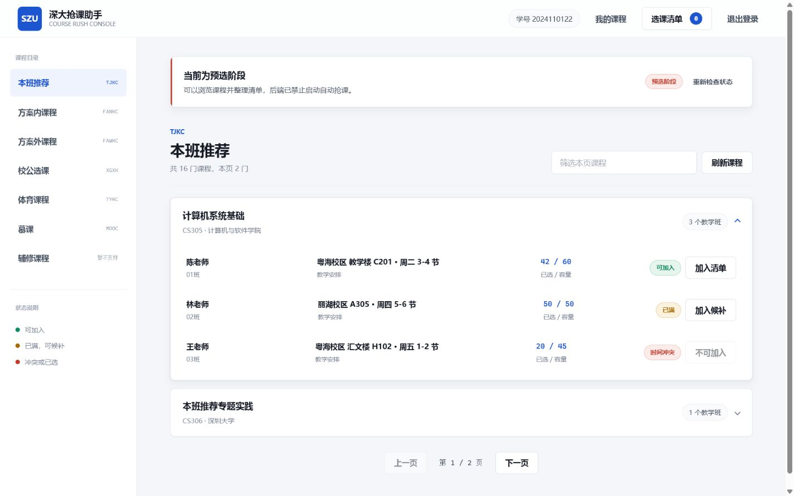
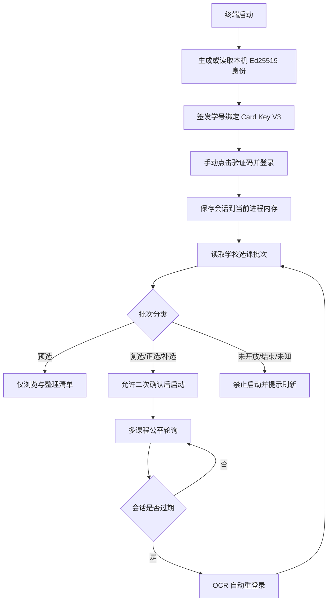

<div align="center">
  

# SZU Course Help

**深大抢课助手 · 本地 WebUI · 手动首登 · OCR 自动重登 · Card Key V3**

[](https://github.com/Weeye-hua/SZU-Course-Help/actions/workflows/ci.yml)


[](LICENSE)

面向深圳大学本科选课系统的本地辅助工具，用于登录、浏览课程、维护待处理清单、查看已选课程，并在学校允许的复选、正选或补选阶段执行受保护的自动选课任务。

作者：[Weeye](https://github.com/Weeye-hua) · Misakait
</div>

> [!IMPORTANT]
> 预选阶段由学校抽签，本项目会禁止启动自动抢课。批次未知、未开放、已结束或无法向学校确认时同样禁止启动。请遵守学校规定并自行承担使用责任。



## 无需 Python：直接下载 Release

不熟悉 Python、Conda 或命令行的用户，请直接前往 **[Releases 下载页面](https://github.com/Weeye-hua/SZU-Course-Help/releases/latest)**，下载与系统匹配的压缩包。发布包已经包含程序、OCR 依赖、Markdown/PDF 使用手册和平台启动脚本，完整解压后即可运行。

- Windows 10/11 x64：双击 `启动抢课助手.bat` 或 `SZU-Course-Help.exe`。
- macOS Apple 芯片：下载 `macos-arm64`，双击 `启动抢课助手.command`。
- macOS Intel：下载 `macos-x64`，双击 `启动抢课助手.command`。
- Linux x64：运行 `启动抢课助手.sh`。

首次运行时，终端会要求输入学号、生成本机 Card Key，并询问是否进入系统。输入 `Y` 后会自动启动本地服务并打开浏览器登录页。详细步骤见 [Markdown 使用手册](docs/USER_GUIDE.md) 和 [PDF 使用手册](output/pdf/SZU-Course-Help-User-Guide.pdf)。

### v3.3.1 更新

- 单门课程连续收到学校无法识别的响应时，保护性暂停阈值由 5 次提高为 200 次；任意一次正常可识别响应都会立即清零该课程计数。
- 阈值可通过 `COURSE_SELECT_UNKNOWN_RESPONSE_LIMIT` 调整，非法值、零或负数会安全回退到默认值 200。
- 修复学校未开放验证码接口时，Release 登录页长期停留在“正在获取验证码”的问题。
- 验证码区域现在明确区分关闭时段、请求超时、学校网络异常、畸形响应和本地服务中断；失败后停止加载，只允许用户手动重试。
- 关闭时段不会自动循环请求验证码，登录按钮保持禁用；学校明确返回不可用状态时，OCR 自动重登录也会立即停止。
- 学校返回“当前时间不在选课开放时间范围内”时只提交一次，随后自动暂停并保留清单，不再归入未知返回连续请求。
- 满员课程持续轮询，不受未知返回阈值限制；未知响应或连续网络异常改为保护性暂停，不再误写为永久失败。
- 清单进度区支持随时暂停和继续，旧逻辑留下的已停止课程可手动重新排队。
- 暂停会先等待当前学校请求结束；页面显示“已暂停”后可移除仍在排队的课程，失败课程也可随时从本地清单移除。
- 删除课程会同步更新实时进度，删除最后一门待处理课程时后台任务会自动收尾，不会留下无法操作的空任务。
- 工作台会显示 OCR 自动重登录的进行中、成功和失败状态；成功后页面与未完成抢课任务自动恢复。
- 自动重登录不会覆盖期间完成的手动新登录；批次刷新短暂失败也不会丢弃已经恢复的有效会话。
- Release 下载区精简为 Windows、macOS、Linux 和源码 ZIP，不再附带独立校验文件。

完整版本记录见 [CHANGELOG.md](CHANGELOG.md)。

> [!NOTE]
> 发布程序目前未购买 Windows 或 Apple 商业代码签名证书，系统可能显示未知开发者提示。请只从本仓库官方 Release 下载，不要运行群文件或网盘中的未知副本。

## 功能概览

| 能力 | 说明 |
| --- | --- |
| 本地 WebUI | FastAPI 仅监听 `127.0.0.1`，提供登录页、课程目录、清单和进度界面 |
| 手动首次登录 | 输入学号、学校密码、Card Key，并按提示点击四字验证码 |
| OCR 自动重登 | 会话过期后自动获取新验证码、识别坐标并恢复 token、Cookie 与批次 |
| 可见会话恢复 | 工作台显示自动重登录进行中、成功或失败；成功后自动继续原任务 |
| 保守阶段门控 | 预选、未开放、已结束、未知批次和批次刷新失败均禁止自动抢课 |
| 多课程公平轮询 | 每轮对每门活动课程提交一次，避免单门课程长期阻塞其他课程 |
| 任务暂停与继续 | 清单中可随时暂停或继续，课程状态与尝试次数不会丢失 |
| 暂停后编辑清单 | 当前请求结束并安全暂停后可移除活动课程；终态课程可直接移除 |
| 冲突保护 | 前端与购物车接口同时阻止已选或时间冲突教学班加入清单 |
| 中断恢复 | SQLite 保存本地清单，异常退出遗留的 `ENROLLING` 会恢复为 `PENDING` |
| 可恢复错误界面 | 区分非开放期、无有效批次、网络失败、超时、异常响应和登录过期 |
| Card Key V3 | 使用本机 Ed25519 身份签发学号绑定卡密，不再使用源码内置通用主密钥 |
| 离线安全测试 | Pytest 会拦截所有未模拟的外部 `requests` 请求，不会误触真实选课接口 |

## 源码运行

### 1. 获取源码

```powershell
git clone git@github.com:Weeye-hua/SZU-Course-Help.git
cd SZU-Course-Help
```

### 2. 准备环境

项目要求 Python 3.13。使用现有 Conda 环境：

```powershell
conda activate course
python -m pip install -r requirements.txt
```

也可以创建独立虚拟环境：

```powershell
python -m venv .venv
.\.venv\Scripts\Activate.ps1
python -m pip install -r requirements.txt
```

### 3. 启动

```powershell
python main.py
```

启动流程：

1. 在终端输入 6 至 12 位数字学号。
2. 首次运行在本机生成 Ed25519 签名身份，并为该学号签发 Card Key V3。
3. 选择是否进入选课系统。
4. 浏览器打开终端给出的本地地址，例如 `http://127.0.0.1:8000/login?ui=...`。
5. 输入学校密码，按验证码顶部提示依次点击四个汉字，完成首次登录。

服务默认使用 8000 端口。端口被占用时，程序会在后续端口中选择可用项。每次启动生成新的 UI 缓存令牌，避免浏览器复用旧页面。

## 工作原理



### 登录、批次与目录是独立状态

“登录成功”不代表学校当前开放选课，也不保证课程目录接口此刻可用。页面分别处理：

- **登录状态**：token 与 Cookie 是否仍然有效。
- **批次状态**：学校是否返回有效 `electiveBatch.code` 与 `typeName`。
- **课程目录状态**：具体课程接口是否成功返回可解析数据。

非开放期或没有有效批次时，前端不会继续请求课程目录，而是保留本地清单并显示“重新检查开放状态”。课程刷新遇到短暂网络错误时，如果同一页已有成功数据，页面会继续显示上次结果，不会突然清空。

## 阶段判断

阶段不按本地日期写死。后端登录后请求学校的 `student/{student_id}.do`，读取：

- `data.electiveBatch.code`：学校当前批次代码，提交时原样使用。
- `data.electiveBatch.typeName`：学校当前批次名称，用于保守分类。

| 分类 | 识别条件 | 自动抢课 |
| --- | --- | --- |
| `preselection` | 名称包含“预选” | 禁止 |
| `automatic` | 名称包含“复选”“正选”“补选”或“补退选” | 允许二次确认后启动 |
| `closed` | 包含“未开放”“不开放”“未开始”“暂停”“关闭”“结束”“截止”“停选”或“维护” | 禁止 |
| `unknown` | 空值或未识别名称 | 禁止 |

关闭关键词拥有最高优先级，所以“补选已结束”“复选未开始”不会因为同时包含允许关键词而误判为开放。

点击“确认启动”后，后端还会向学校重新刷新一次批次。刷新失败、批次缺失、登录状态在请求期间变化或当前阶段不在白名单时，后台任务都不会创建。

## 课程目录

| 页面目录 | 学校类型 | 状态 |
| --- | --- | --- |
| 本班推荐 | `TJKC` | 使用专用 `elective/recommendedCourse.do` |
| 方案内课程 | `FANKC` | 支持 |
| 方案外课程 | `FAWKC` | 支持 |
| 校公选课 | `XGXK` | 支持 |
| 体育课程 | `TYKC` | 支持 |
| 慕课 | `MOOC` | 支持 |
| 辅修课程 | `FXKC` | 当前明确禁用 |

WebUI 页码从 1 开始，后端转换为学校接口需要的 0 起始页码。学校目录接口固定每页 10 门课程。

前端不会因为课程组被标记为 `selected` 就隐藏整个课程；每个教学班会根据 `is_choose`、`is_conflict` 和 `is_full` 独立展示。已选或冲突教学班无法加入清单，满员但不冲突的教学班可加入候补清单。

## 自动选课行为

- 每轮对每门活动课程各提交一次，避免一门课独占循环。
- 成功后立即标记 `SUCCESS` 并停止该课程，其余课程继续。
- 容量已满属于正常可重试状态，课程持续保留在活动集，不受“20 次”或未知返回阈值限制。
- 已选、时间冲突、超过学分等明确且重试无效的错误才会标记为 `FAILED`。
- 批次名称可能是“正选”，但学校的实际开放时段仍可能尚未开始。收到明确的未开放响应后，任务只请求一次便自动暂停，开放后可手动继续。
- 连续未知响应或连续网络异常达到保护阈值后暂停整个任务并保留课程，避免接口变化造成无限请求；不会把课程永久写成失败。
- 清单进度区可以暂停或继续；暂停会在当前学校请求结束后生效，继续前会重新向学校确认批次仍允许自动选课。
- 后台任务独立于 HTTP 请求运行，长时间暂停不会占住页面请求，关闭程序后下次启动会恢复中断课程为待处理。
- 同时只允许一个后台任务；运行期间清单锁定且不能退出登录。
- 状态流转为 `PENDING -> ENROLLING -> SUCCESS/FAILED`。

学校选课提交 URL、字段和 `addParam` 格式保持原协议，并由固定契约测试保护。

## OCR 自动重登录

首次登录始终由用户手动完成。只有学校会话过期后，程序才执行 OCR 恢复：

1. 使用当前进程内存中的学号和密码获取新 `vtoken`。
2. 下载点击验证码并校验内容类型、JPEG 文件头、Cookie、尺寸和 2 MiB 上限。
3. 分离顶部目标文字区与底部候选文字区。
4. 使用 `ddddocr` 识别候选字符及边界框；可选 PaddleOCR 识别顶部四字提示。
5. 按目标顺序做不重复匹配，计算四个边界框中心坐标。
6. 重新生成学校要求的 `loginPwd` 并调用登录接口。
7. 原子更新 token、Cookie 与批次，后台任务从未完成课程继续。

每次自动重登录最多尝试 **50** 张验证码，失败间隔会渐进增加但不超过 1 秒。多个请求同时发现过期时，只允许一个 OCR 恢复流程运行，其他请求复用恢复后的会话。

工作台会持续显示“正在自动重新登录”。恢复成功后无需刷新页面，课程数据与未完成抢课任务会自动继续；连续恢复失败时任务暂停，完成手动登录后可返回清单点击“继续任务”。网页状态中不会包含密码、Cookie、token 或验证码内容。

可选 PaddleOCR 回退默认关闭：

```powershell
$env:COURSE_SELECT_USE_PADDLE_OCR = "1"
python main.py
```

## 密码学与敏感数据

项目中有两套用途完全不同的机制。

### 学校 `loginPwd` 协议

学校登录接口要求兼容其旧版前端协议。`school_password.encrypt_school_password()` 使用移植自 `des.js` 的固定 DES 变换和学校 Base64 规则生成线协议字段。这不是本地密码存储方案，也不能擅自替换为 AES 或哈希，否则学校服务器无法识别。

学校密码只保存在当前 Python 进程内存中，用于会话过期后的自动恢复；注销或退出后清除，不写入 SQLite。

### Card Key V3

Card Key V3 使用 Ed25519 数字签名：

- 令牌格式为 `SZU3.<规范化JSON>.<Ed25519签名>`。
- 载荷包含版本、学号、签发时间、随机 nonce 与公钥指纹。
- Card Key 与当前安装生成的密钥身份绑定，更换密钥会使旧卡密失效。
- 学号不是秘密；签名目标是防篡改和真实性验证，而不是隐藏学号。
- Card Key 只在本地校验，不会发送给学校。

> [!CAUTION]
> `card_signing_private.pem` 是签发权限，绝不能提交到 Git、上传网盘或发给他人。仓库已忽略所有 `*.pem` 和 `*.key`，但推送前仍应检查暂存区。

可通过环境变量加密私钥文件：

```powershell
$env:COURSE_SELECT_KEY_PASSPHRASE = "你的本机私钥口令"
python main.py
```

## 配置

可复制 `.env.example` 了解支持的环境变量。程序不会自动读取 `.env` 文件，应在终端或系统环境中设置。

| 环境变量 | 默认值 | 作用 |
| --- | --- | --- |
| `COURSE_SELECT_DATA_DIR` | 项目运行目录 | OCR 与运行数据目录 |
| `COURSE_SELECT_DB_PATH` | `course_enroll.db` | 本地清单数据库路径 |
| `COURSE_SELECT_KEY_DIR` | 源码目录或可执行文件目录 | Card Key 密钥目录 |
| `COURSE_SELECT_KEY_PASSPHRASE` | 空 | 加密 Ed25519 私钥 |
| `COURSE_SELECT_PORT` | `8000` | 本地 WebUI 首选端口 |
| `COURSE_SELECT_USE_PADDLE_OCR` | `0` | 启用 PaddleOCR 顶部文字回退 |
| `COURSE_SELECT_NO_BROWSER` | `0` | 启动时不自动打开浏览器 |

## 项目结构

```text
SZU-Course-Help/
├─ main.py                    # 终端入口、Card Key 签发、WebUI 启动
├─ app.py                     # FastAPI 路由、阶段门控、静态资源
├─ logic.py                   # 学校登录、批次、验证码与 OCR
├─ choose_course.py           # 已选课程查询与选课提交协议
├─ course_list.py             # 课程目录请求
├─ course_models.py           # 学校响应模型与前端投影
├─ school_password.py         # 学校 loginPwd 协议入口
├─ school_session.py          # 统一会话过期识别
├─ database.py                # SQLite 清单与中断恢复
├─ services/                  # 认证、课程、清单、后台任务服务
├─ security/key_manager.py    # Ed25519 Card Key V3
├─ static_dist/               # 登录页与课程工作台
├─ tests/                     # 离线测试、夹具与假数据 UI 预览
└─ .github/workflows/ci.yml   # GitHub Actions
```

## 开发与验证

```powershell
conda activate course
python -m pip install -e ".[test]"

python -m ruff check .
python -m ruff format --check .
python -m compileall -q .
python -m pytest -q
node --check static_dist/login.js
node --check static_dist/course-app.js
```

测试覆盖学校密码固定向量、Card Key 签发与篡改、Cookie 解析、OCR 重试、并发会话恢复、批次分类、课程接口契约、`TJKC` 专用端点、冲突拦截、购物车恢复、结果分类和异常提示。

`tests/conftest.py` 会拦截所有未模拟的外部 HTTP 请求，因此自动测试不会连接深圳大学系统或提交选课。

### 假数据 UI 预览

```powershell
python tests/ui_preview_server.py
# http://127.0.0.1:8001/
```

可以切换预览状态：

```powershell
$env:COURSE_SELECT_PREVIEW_PHASE = "closed"      # 非开放期
$env:COURSE_SELECT_PREVIEW_PHASE = "unknown"     # 无有效批次
$env:COURSE_SELECT_PREVIEW_PHASE = "automatic"   # 补选阶段
$env:COURSE_SELECT_PREVIEW_LOGGED_OUT = "1"
$env:COURSE_SELECT_PREVIEW_CAPTCHA = "unavailable" # 验证码接口未开放
python tests/ui_preview_server.py
```

预览服务的课程、登录态和批次刷新均为本地假数据，不会请求学校系统。

## 打包

源码验证完成后可使用 Nuitka：

```powershell
python -m pip install -e ".[build]"
.\build.bat
```

输出位于 `build/CourseEnroll/`。签名密钥、数据库和日志不会嵌入打包结果；首次运行会在可执行文件旁生成新的安装身份。

## 常见问题

### 登录成功后为什么显示“暂未读取到选课批次”？

登录接口成功，但学校没有返回有效批次。通常是选课尚未开放、批次切换或学校服务短暂波动。点击“重新检查开放状态”即可，本地清单不会丢失。

### 为什么登录页显示“当前时段暂无验证码”？

学校在预选、复选、正选、补选或补退选以外的时段，可能直接关闭登录验证码接口。程序会停止本次加载、禁用登录按钮并保留“重新获取验证码”按钮；等待学校开放或维护结束后再手动重试即可。该状态不表示密码或 Card Key 错误。

### 为什么非开放期看不到课程？

学校在非开放期可能拒绝课程目录请求。程序会在已知 `closed` 或没有批次代码时提前停止请求，并给出状态提示，避免把正常的“未开放”误报为登录失败。

### 为什么显示“正选”却在启动后自动暂停？

“正选”是学校返回的批次名称，不一定代表当前分钟已进入该批次的实际开放时段。程序不会用本地写死日期猜测开放时间；第一次提交若收到“当前时间不在选课开放时间范围内”，会立即暂停且不再重复请求。等学校正式开放后，在选课清单中点击“继续任务”即可。

### 正式开放后抢不到，会不会尝试 20 次就停止？

不会。课程满员是明确的可重试状态，会持续轮询，直到抢到、出现不可恢复错误、你手动暂停，或遇到连续网络异常或连续 200 次未知响应而触发保护性暂停。未知计数按课程分别维护，只统计连续未知响应；中间只要收到一次可识别结果就会清零。需要自定义时可在启动前设置 `COURSE_SELECT_UNKNOWN_RESPONSE_LIMIT`，但不建议取消保护。

### 为什么刷新失败后课程没有消失？

同一目录和页码已有一次成功结果时，网络或学校接口的短暂失败只会提示刷新失败，页面继续展示上次成功数据。切换目录或页码时不会混用旧数据。

### 为什么辅修课程不可用？

部分学生访问 `FXKC` 会被学校接口拒绝。当前版本显式禁用该类别，避免展示不可靠结果。

### 为什么旧 Card Key 无法使用？

V3 已弃用旧版固定主密钥方案。Card Key 还与当前安装的 Ed25519 公钥指纹绑定；丢失或更换密钥后需要重新签发。

### 页面还是旧 UI 怎么办？

确认终端启动的是当前源码目录的 `python main.py`，并使用终端本次打印的带 `?ui=...` 地址。静态资源包含构建版本号，每次进程也会生成独立缓存令牌。

## 贡献与安全

- 贡献规范见 [CONTRIBUTING.md](CONTRIBUTING.md)。
- 敏感数据与漏洞报告说明见 [SECURITY.md](SECURITY.md)。
- 提交 Issue 前请先脱敏，不要公开学号、密码、Cookie、token、验证码或 Card Key。

## 免责声明与许可证

本项目是非官方工具，与深圳大学及其选课系统运营方无隶属或授权关系。学校接口、规则和页面可能随时变化。使用者应遵守学校规章、适用法律和上游系统限制，并自行承担账号、选课结果与系统风控风险。

项目采用 [MIT License](LICENSE) 发布。许可证允许使用、复制、修改、合并、发布和分发，但软件按“原样”提供，不附带任何明示或默示担保。学校系统使用规则与适用法律仍独立约束每位使用者。
